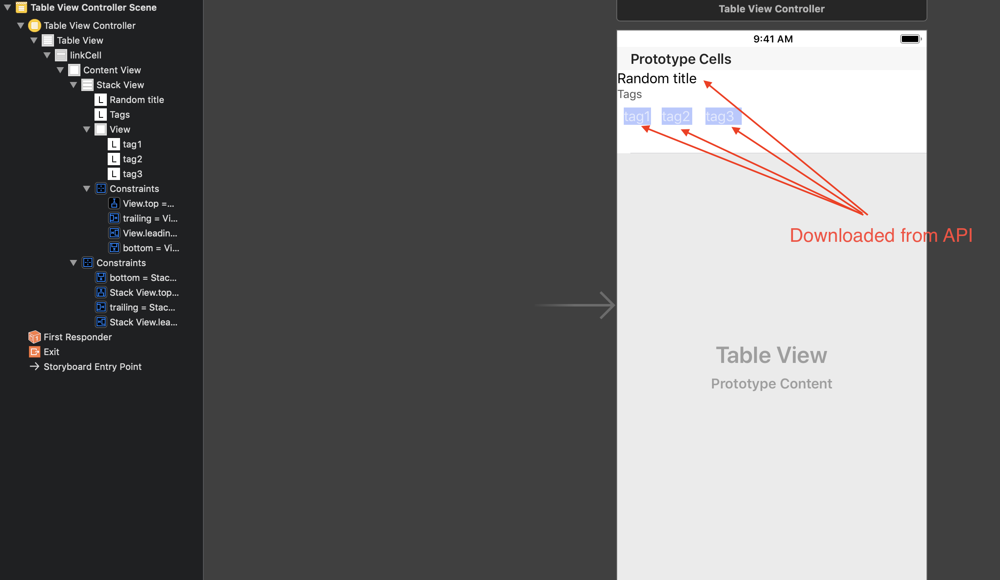
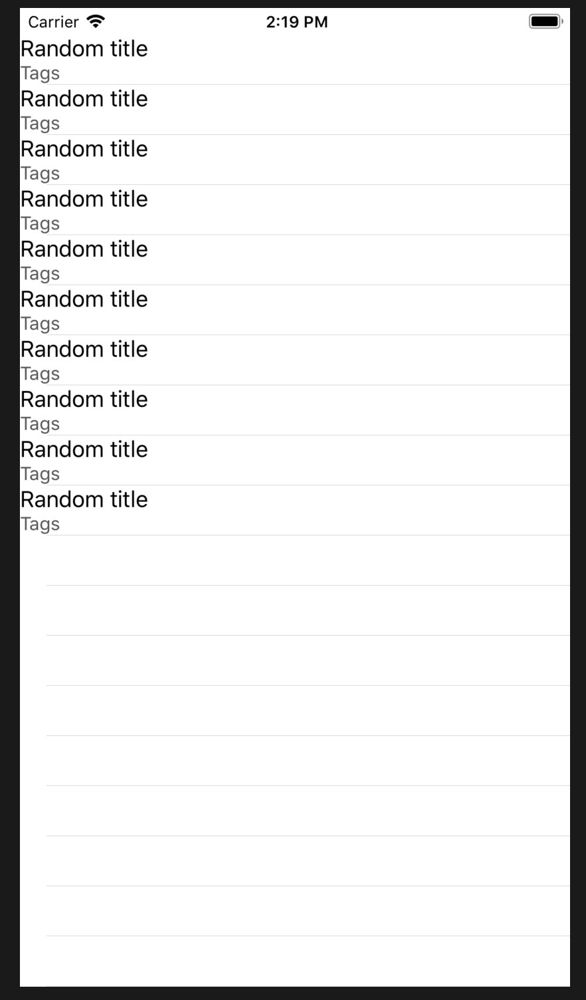

#  stackview-in-table-cell

This static version of UI i am trying to bring to life. What follows is screenshot of IB which is schematically what I want to achieve.

Unfortunately when I run the app, the tags list is not visible :(

